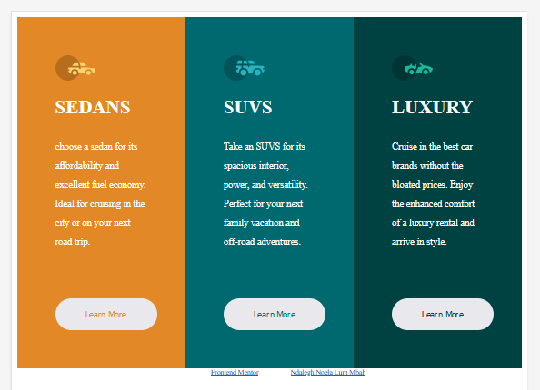
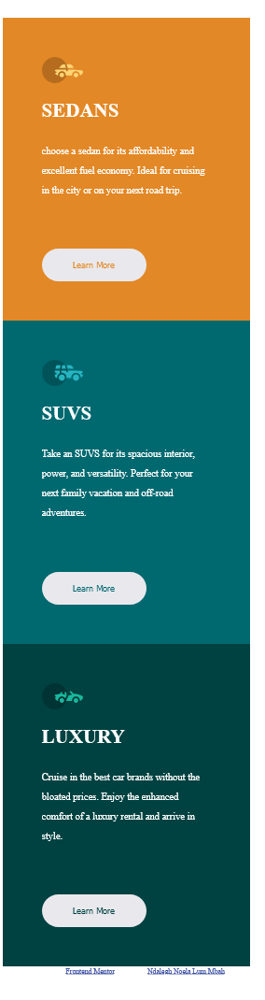

# Frontend Mentor - 3-column preview card component solution

This is a solution to the [3-column preview card component challenge on Frontend Mentor](https://www.frontendmentor.io/challenges/3column-preview-card-component-pH92eAR2-). 

## Overview
The general overview of this file is to build a responsive 3-column preview component
### The challenge

Users should be able to:

- View the optimal layout depending on their device's screen size
- See hover states for interactive elements

### Screenshot





### Links

- Solution URL: [Add solution URL here](https://your-solution-url.com)
- Live Site URL: [Add live site URL here](https://your-live-site-url.com)

## My process

### Built with

- Semantic HTML5 markup
- CSS custom properties
- Flexbox
- CSS Grid
- [Styled Components](https://styled-components.com/) - For styles


### What I learned

  I learned about the float and clear property as well as web page grid views which helped me to make the web page responsive
  It was interesting to know about the twelve grid views each constituting of a width of (100/12)% =8.33%.
  It was difficult inducing flexbox for the responsiveness and using the float property was a more suitable alternative. 


```html
<h1>Some HTML code I'm proud of</h1>
```
```css
[class*="col-"] {
  float:left;
  padding:60px;
  width:100%;
}
.row::after{
  clear: both;
  content: "";
  display:table:

}

```


### Continued development
I intend to work next on making a responsive navbar.

### Useful resources

-(https://www.w3schools.com) - This helped me discover about the foat and css grid lines.It has alot of enriching resources which I really like pattern and will use it onward.


## Author

- Website - [Ndalegh Noela Lum Mbah](https://www.your-site.com)
- Frontend Mentor - [@Ndalegh_Noela](https://www.frontendmentor.io/profile/Ndalegh_Noela)
- Twitter - [@Ndalegh_Noela](https://www.twitter.com/Ndalegh_Noela)


## Acknowledgments

I'm grateful to Frontend Mentor for providing me with all the directives and resources used for the project.
I'm thankful to a friend, Sindze Djam Alan for introducing me to Frontend Mentor
I'm als thankful to W3schools for the wonderful resources which has helped me.
